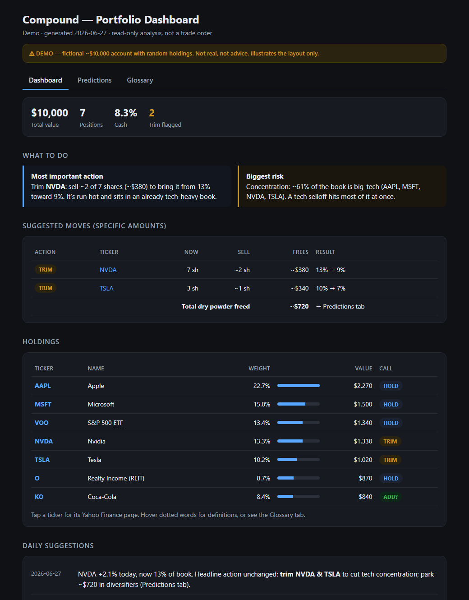
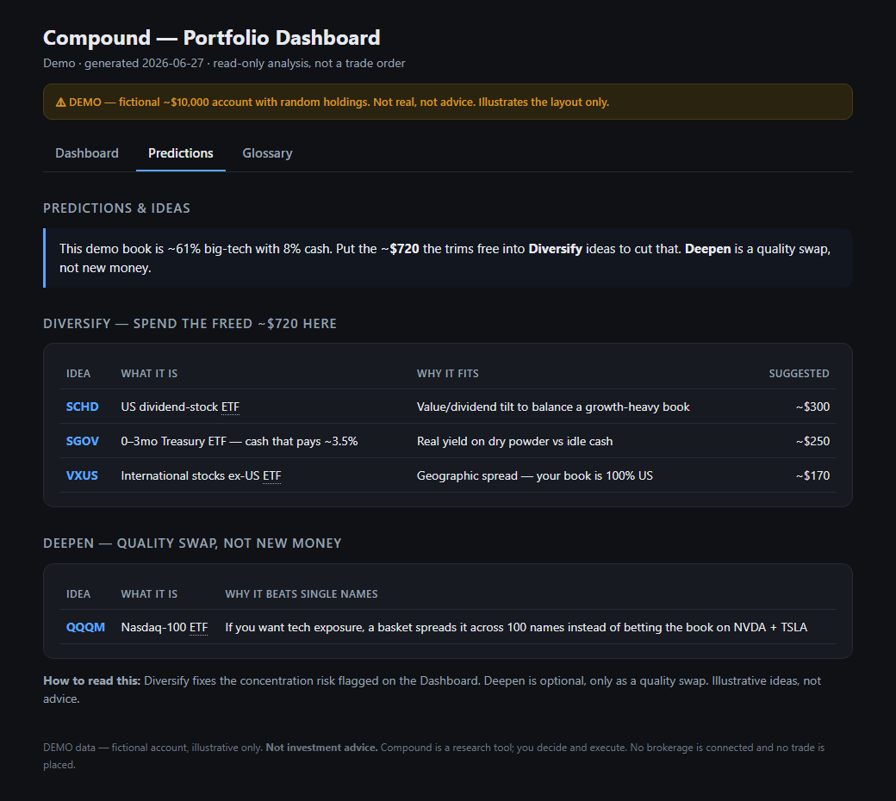
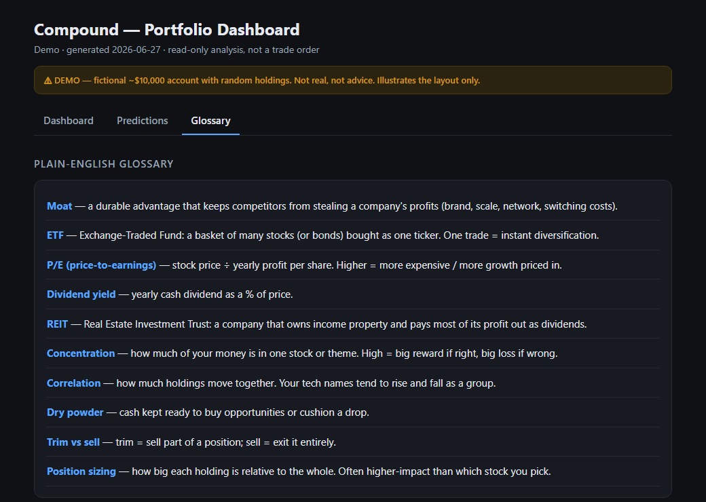

# Compound

**One command. Paste your holdings. Get a value-investing read on every position — as a dashboard you actually want to look at.**

Compound is a Claude Code tool that runs your portfolio through the frameworks of four
value investors — **Buffett, Munger, Duan Yongping, Li Lu** — and generates a
self-contained HTML dashboard with a buy / add / hold / trim / sell call on each name,
concrete trim amounts, a glossary for every bit of jargon, and diversification ideas
sized to your spare cash. It is **read-only**: it never connects to your brokerage and
never places a trade.

---

> ## ⚠️ This is NOT investment advice
>
> **Compound is a research and learning tool, not a financial advisor.** Nothing it
> produces is investment, financial, legal, or tax advice, or a recommendation to buy
> or sell anything. It is software that summarizes public data and applies a framework
> — it can be wrong, out of date, or miss things entirely.
>
> **What you do with its output is entirely your decision and your responsibility.**
> The authors and contributors are **not responsible** for any losses, decisions, or
> outcomes that result from using this tool. It comes with **no warranty of any kind**
> (see the MIT License). Markets carry real risk of loss. **Do your own research and/or
> consult a licensed professional before making any financial decision.**
>
> Compound is a **fork of [AI Berkshire](https://github.com/xbtlin/ai-berkshire)** by
> xbtlin — full credit below. This fork refines it toward one dead-simple tool, in
> English, privacy-first. It is an independent project, not affiliated with or endorsed
> by Anthropic, Robinhood, Yahoo, or any of the investors whose publicly-shared
> philosophies it references.

---

## What it looks like

> All screenshots use **fictional demo data** (a made-up ~$10k account). Not real holdings, not advice.

**Dashboard** — calls, concrete trim amounts, weight bars, clickable tickers, a running daily log:



**Predictions** — diversification ideas sized to the cash your trims would free, with live prices and fees:



**Glossary** — every piece of jargon in plain English (and as hover-tooltips throughout):



---

## What it does

```
You:  AAPL 10, MSFT 4, VOO 2, $500 cash
      (or: point it at a Robinhood / brokerage export CSV)

/compound:
  1. Parses your holdings and shows you the table — confirms before doing anything
  2. Screens each name (7 hard quality indicators)
  3. Researches each real business through the 4-master team (in parallel)
  4. Analyzes the portfolio: concentration, correlation, opportunity cost, stress test
  5. Writes a markdown report AND a self-contained HTML dashboard you open in a browser
```

No login. No credentials. No API keys. You paste a list or drop a CSV; that's the whole setup.

## Quickstart

```bash
git clone <your-fork-url> compound
cd compound

# install the skills as Claude Code commands
cp skills/*.md ~/.claude/commands/

# in Claude Code:
/compound
# then paste your holdings when asked
```

The dashboard is written to `reports/private/dashboard.html` — open it in any browser.
A live demo (fictional data) is at `assets/demo/dashboard.html`.

The Python helpers in `tools/` (exact market-cap / valuation math, report audit) run with
zero external dependencies — standard library only.

## Daily automation (optional)

Compound can refresh itself on a schedule so the dashboard stays current and builds a
running log of suggestions.

- **How it works:** `/compound daily` reads your saved holdings from
  `reports/private/holdings.txt`, **re-prices** every position, regenerates the
  dashboard, and prepends a dated entry to the "Daily suggestions" log. It does **not**
  re-run the expensive deep research every day — that's a weekly thing.
- **Enable it (Windows):** point Task Scheduler at `scripts/daily.ps1`.
- **Enable it (macOS/Linux):** add `scripts/daily.sh` to cron, e.g. `0 8 * * * /path/to/compound/scripts/daily.sh`.
- **Disable it (Windows):** `Unregister-ScheduledTask -TaskName "Compound-Daily-Portfolio" -Confirm:$false`

> Each scheduled run spends Claude API tokens and runs unattended (with permissions
> bypassed for the run). You own that cost and that decision. Daily = cheap re-pricing;
> save the full re-research for weekly.

## How this fork is different

| | AI Berkshire (upstream) | Compound (this fork) |
|---|---|---|
| Surface | ~18 skills you toggle | **one command, `/compound`** |
| Output | markdown reports | **markdown + a self-contained HTML dashboard** |
| Input | per-skill prompts | **paste holdings or a brokerage CSV** |
| Language | Chinese-first | **English throughout** |
| Privacy | reports committed to repo | **your real holdings are gitignored, never committed** |
| For beginners | assumes knowledge | **glossary + tooltips for every term** |

The depth is inherited, not thrown away — the screen, four-master research, and
portfolio frameworks are the original's work. Compound removes the toggling and the
manual steps, and wraps the output in something a beginner can actually read.

## What's under the hood

`/compound` orchestrates the original frameworks as internal stages: `quality-screen`
(7 hard indicators), `investment-team` (four parallel master lenses), and
`portfolio-review` (concentration, correlation, opportunity cost, stress tests). It
right-sizes effort to account size, and flags holdings a value framework can't assess
(crypto, copy-trade ETFs, momentum names) instead of forcing a verdict. The other
skills (`earnings-review`, `industry-research`, `thesis-tracker`, …) remain in `skills/`
for deeper single-name work.

## Privacy

Your real holdings, reports, and dashboard live under `reports/private/` and daily logs
under `logs/*.log` — **all gitignored**. They never get committed or pushed. The only
portfolio data in this repo is fictional demo/sample data.

## Disclaimer (the important part, again)

- **Not investment advice.** Compound's output is automated analysis for research and
  learning. It is not advice, not a recommendation, and not a solicitation to buy or
  sell any security or asset.
- **No warranty.** The software is provided "as is", without warranty of any kind. Data
  may be wrong, delayed, or incomplete. Calculations and AI-generated analysis can be
  flat-out wrong.
- **Your responsibility.** Any action you take is your own decision. The authors and
  contributors accept **no liability** for any loss or damage arising from use of this
  tool. Use it however you want — but the outcomes are yours.
- **Do your own research.** Verify everything. Consider consulting a licensed financial
  professional before making decisions. Never invest money you can't afford to lose.

## Acknowledgments

This project is a fork of **[AI Berkshire](https://github.com/xbtlin/ai-berkshire)** by
**xbtlin**. The four-master research methodology, the screening and valuation
frameworks, the Python rigor tools, and the original design are all the original
author's work — this fork stands entirely on that foundation. The frameworks draw on
the publicly shared philosophies of Warren Buffett, Charlie Munger, Duan Yongping, and
Li Lu. Compound is an independent project and is not affiliated with, endorsed by, or
connected to any of them, or to Berkshire Hathaway Inc.

## License

[MIT](LICENSE) — original copyright xbtlin, with this fork's contributors added. The
MIT License's "no warranty" and "no liability" terms apply to everything above.
